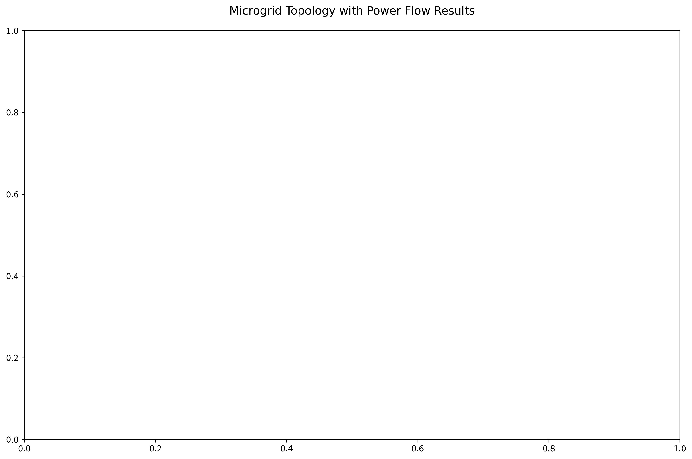

🔌 Microgrid Simulation with Pandapower



A comprehensive simulation of a 5-bus microgrid system with renewable generation and energy storage, built using the Pandapower library.

## 📋 Project Overview

This project demonstrates the modeling and analysis of a microgrid system that includes:
- 5 buses (connection points) at 20kV
- Grid connection (slack bus)
- Solar power generation
- Electrical load
- Battery energy storage
- Transmission lines with realistic electrical properties

## 🚀 Features

- **Power Flow Analysis**: Calculate voltage profiles, power flows, and system losses
- **Interactive Visualization**: Built-in Plotly-based visualization of the grid
- **Component Modeling**: Detailed modeling of generators, loads, and storage
- **Scenario Analysis**: Tools for testing different operating conditions

## 📂 Project Structure

```
microgrid-simulation/
├── data/                     # Data files and parameters
├── results/                  # Output files and visualizations
│   └── microgrid_topology.*  # Generated topology images and HTML
├── scripts/                  # Python scripts
│   ├── build_microgrid.py    # Main grid construction and simulation
│   └── scenario_analysis.py  # Scenario testing and analysis
├── .gitignore
├── README.md                 # This file
├── requirements.txt          # Python dependencies
├── pandapower_explained.md   # Beginner's guide to Pandapower
└── build_microgrid_detailed.md # In-depth technical documentation
```

## 🛠️ Installation

1. **Clone the repository**
   ```bash
   git clone <repository-url>
   cd Microgrid-Simulation-with-Pandapower
   ```

2. **Create and activate a virtual environment**
   ```bash
   python -m venv .venv
   .\.venv\Scripts\Activate.ps1  # On Windows
   ```

3. **Install dependencies**
   ```bash
   pip install -r requirements.txt
   ```

## 🏃‍♂️ Quick Start

1. Run the main simulation:
   ```bash
   python scripts/build_microgrid.py
   ```

2. View the results:
   - Interactive HTML visualization: `results/microgrid_topology.html`
   - Static image: `results/microgrid_topology.png`
   - Console output showing power flow results

## 📊 System Components

### 1. Buses (Nodes)
- 5 buses at 20kV nominal voltage
- Bus 1: Grid connection (slack bus)
- Bus 2: Solar generator
- Bus 3: Load
- Bus 4: Battery storage
- Bus 5: Additional connection point

### 2. Power Sources
- **Grid Connection**: 20kV external grid connection
- **Solar Generator**: 3 MW renewable generation

### 3. Loads
- **Active Load**: 2 MW constant power load

### 4. Energy Storage
- **Battery**: 5 MWh capacity, 1 MW charge/discharge rate
- Initial state of charge: 50%

### 5. Transmission Lines
- 4 lines connecting all buses
- Realistic R, X, and C parameters
- 10 km maximum length

## 📈 Power Flow Analysis

The simulation performs a power flow analysis to determine:
- Voltage magnitude and angle at each bus
- Active and reactive power flows in all lines
- Power generation and consumption
- System losses

## 📚 Documentation

For more information, see:
- [Pandapower Explained](pandapower_explained.md) - Beginner's guide
- [Technical Documentation](build_microgrid_detailed.md) - In-depth technical details

## 📝 License

This project is licensed under the MIT License - see the [LICENSE](LICENSE) file for details.

## 🙏 Acknowledgments

- Built using the [Pandapower](https://www.pandapower.org/) library
- Visualization powered by [Plotly](https://plotly.com/) and [NetworkX](https://networkx.org/)

---

💡 **Tip**: Check out the interactive visualization in `results/microgrid_topology.html` for an interactive exploration of the microgrid!
